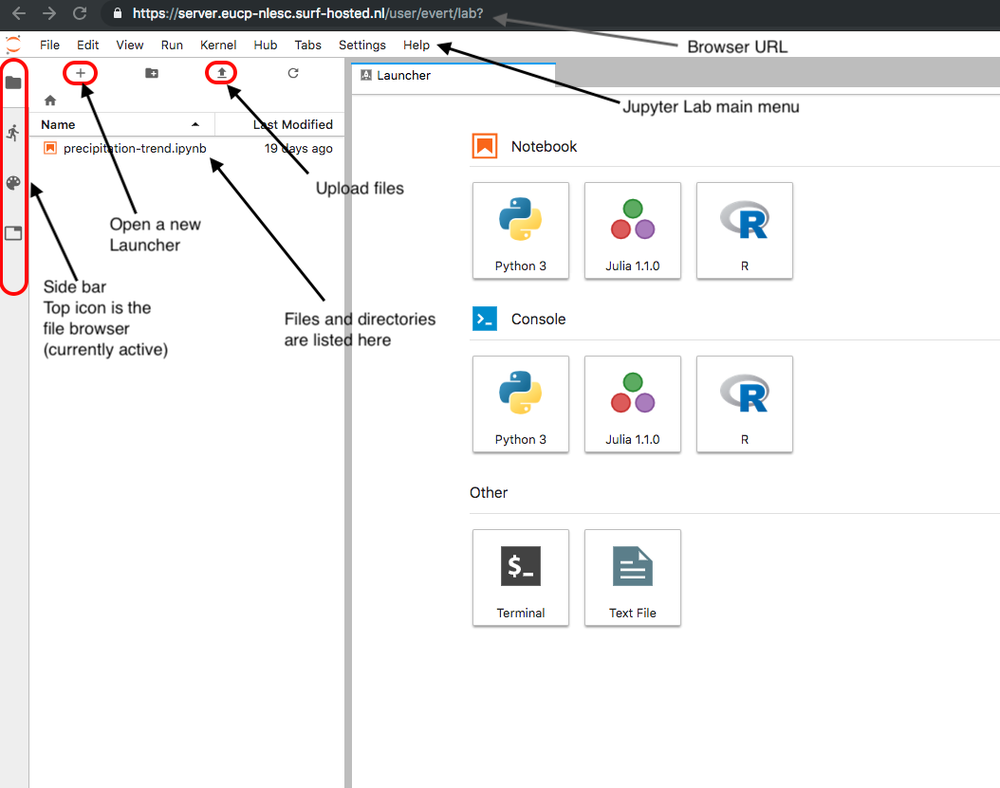

= Tutorial
:toc:
:sectlinks:

This introduction aims to show basic usage of a Jupyter notebook, with some details geared towards users inside the EUCP project.
For more details on Jupyter notebooks and usage, there are lots of resources on the internet for further reading.

This particular introduction will not show any actual code examples: it keeps it more general, and tries to point out how the Jupyter Hub interface works, and what some things are to be aware of.
There will be pointers near the end to actual code examples.
The latter, though, have more to do with how to perform some specific analysis in a specific language (Python, mostly), than how to work with a Jupyter Hub.

Note that you can get more (and possibly better) documentation from the help menu inside the notebook: "Help -> JupyterLab Reference".

== Logging in

You should have a login with a password; the NLeSC should be able to provide you with one.
You can then log in to the notebook interface at https://server.eucp-nlesc.surf-hosted.nl .

Once logged in, you're inside the Jupyter lab environment: from here, you can start a notebook from the launcher in the right pane, an editor or even a terminal (running in your browser, but fully functional).

The picture below is annotated to indicate some essential parts of the interface, which will be referred to elsewhere in this documentation. See also https://jupyterlab.readthedocs.io/en/stable/user/interface.html for a more detailed overview.

.The main Jupyter Lab interface
[#jupyterlab-interface]

The launcher is your main starting point; click the plus symbol in the file browser  toolbar to open it if you don't see it.
From the launcher, you can open an empty notebook, a "console", a terminal (opens in your home directory) or a plain text editor.
The console is essentially the classic Python (or Julia, or R) command line interpreter; it is rarely useful.

You can also open files directly by double clicking on their name, or with right click, "open".
The program with which it opens will depend on the file type, that is, the extension (the "precipitation-trend.ipynb" would open with a notebook; usually, the metadata inside the file tells Jupyter whether this is a Python, Julia or R notebook).

For people used to the default Jupyter notebook interface, you can reach this in two ways:

* Pick the "Help" menu, then the "Launch Classic Notebook" item.
* Change the last bit of the URL, `/lab...` into `/tree`.

The latter indicates how to get back from the classic interface to the lab environment: make sure the URL ends with `/user/<username>/lab`.

Sessions are saved across logins: if you entered something in a notebook and then log out, it will be there once you log back in. Also, if you close a notebook, you can easily reopen it from the panel on the left (provided the panel is in file browser mode: click the folder icon just below the Jupyter icon in the top left).

To properly log out, don't simply close the browser tab: select the Hub -> Logout menu item in the Lab environment. This will prevent other people (mis)using your Jupyter session.

=== ssh login

For those who prefer ssh login, this is also possible: use the standard port 22 login to the same server:

[source]
----
ssh <username>@server.eucp-nlesc.surf-hosted.nl
----

And of course, you can use ssh keys as well.

For convenience, the `screen` and `tmux` terminal emulators are installed.

Limited packages are available when using the ssh access; the normal JupyterHub login should be used for that.
Note that several goals for which you may want to use `ssh`, can also be achieved using the terminal application in the Jupyter Lab environment, including running long-running programs.
See below for more information on the latter.

== Basic usage of a notebook

A Jupyter notebook gives you the ability of executing code in steps, iterating on a single several times. Graphs can also be drawn in the notebook, and the iteration aspect makes it possible to tweak the graph quickly and easily.
Even fuller interaction exists for some types of graphs, see other tutorials.

The individual steps in a notebook are called "cells".
You type one or more lines of (Python) code into a cell, and executes the cell, by either clicking the "run" triangle at the top of the notebook, or using the "shift-enter" keyboard shortcut.

The currently active cell is highlighted by a (blue) thick line to its left, and surrounded by a (blue) line when it is ready for input.
Arrow keys can walk up and down previous and next cells, or select a cell with the pointer.

Note that the notebook has essentially two modes: one where commands (or text) can be inserted, called "edit mode", and a mode where extra commands can be issued, called "command mode".
A highlighted cell (and blinking cursor) indicates edit mode, while an active but greyed-out cell indicates command mode.
Use enter to get into edit mode, and use escape to get into command mode.

Most commands work both in edit and command mode, such as running a cell using shift-enter.
Some keyboard shortcuts, such as "d d" (which deleted the selected cell(s)), only work in command mode.
If you are using the mouse and menu items, you'll find there is not much difference between the two modes.
Note that you can select multiple cells and apply commands such as the aforementioned "d d" (menu item: Edit - Delete Cells) command.

Type in some simple code, then see the effect when you run a cell.
To save your work, use "File -> Save Notebook" or simply control-s / command-s (depending on your OS & browser combination).
You may want to rename the notebook from the standard "Untitled.ipynb": right-click on the tab of the relevant notebook and pick the first item: "Rename Notebook...".
Or use "File -> Save Notebook As..." / shift-control-s / shift-command-s.

=== Output

The output from each cell is whatever the last line returns.
There is no print function needed, but if you want output from earlier lines in the cell, you will need to use `print()` or something similar (such as logging functions).
You can avoid output by assigning to a variable (the underscore variable can be useful here), or appending a semi-colon, `;`, at the end of the last line.

=== Cell type

Cells can be of another type than code: plain text ("raw") and Markdown are also possible.
Select the cell type from the "Code" menu item at the top of the notebook.
Note that "code" type of cells have an (empty) number holder in front of them `[ ]:`.
Markdown is a simple mark-up language, and it is useful if you want to provide a bit more layout (lists, tables, headings, indented text) than you can achieve with raw text.
You'll need to "run" a Markdown cell to actually render it into HTML.
If you select to edit a Markdown cell, it will automatically revert to Markdown (from HTML) until you rerun it, after which it will show rendered HTML again.

The code type is always that of the chosen kernel. You can change the kernel of a notebook, although this will be of limited use (it was useful for transitioning Python 2 to Python 3 code).
There are ways of running, for example, an R code block in a few cells inside a Jupyter Python (3) notebook.
For reproducibility and convenience of other users, however, we don't recommend this.

You can thus switch your cell type between code and Markdown, providing text between your code that is more readable than standard Python comments.
This is, for example, widely used for teaching purposes.
It is generally used to explain steps in the next cell(s) better than a set of comments.
All data (variables, function definitions etc) are saved between cells, not hampering execution.

A nice example of this is the online Python Data Science Handbook by Jake Vanderplas: a few dozen notebooks are listed at https://github.com/jakevdp/PythonDataScienceHandbook/tree/master/notebooks .
Conveniently, GitHub can render Jupyter notebooks: when selecting a notebook on GitHub, GitHub will attempt to render it with Markdown-to-HTML formatting and figures (though some larger notebooks will fail to render).
Note that figures are saved *with* the notebook: there is no actual execution of the code in a rendered notebook, just the notebook as last saved by the creator.

== Executing and editing an existing notebook

Other than creating your own notebook, you can also grab a notebook from a colleague, and run it yourself.
Very similar to running a script, but this time, you can easily stop halfway, edit some lines of code, then execute the rest with your changes.

As an example, you could download one of the aforementioned data science handbook example notebooks.
Pick one you like (e.g., the K-means tutorial, notebook 05.11; it may take a few tries for GitHub to render it)footnote:[it is an unfortunate effect of the rapid development in some Python packages, that several of the machine learning examples here already suffer from backwards incompatibility: some modules used have been removed, replaced or renamed, and as a result, some of these notebooks will not execute properly].
Select the "Download" or "Raw" option near the top on the GitHub page, which will likely render the raw notebook contents in your web browser (a JSON file).
Save this raw page somewhere on your local machine (preferably keep the extension to be `.ipynb`), then in the Jupyter lab on the server, in the file browser (left pane, the folder icon), select "Upload Files" (line with up-arrow above it).
Once the notebook is uploaded, Jupyter Lab will recognise it by its extension as a Jupyter notebook, and either double-clicking or right-click -> Open should start a new notebook with all the content already in it, including the graphics.
(There is, as far as a I know, not yet a way to open a remote notebook directly from a Jupyter Lab, by giving it the URL of the file or the URL of the GitHub repository item: you'll have to download and upload it yourself.)

You can now execute the cells top-down one by one (shift-enter nicely steps through each cell), which will recreate the graphs; and edit cells in the notebook as you see fit.
In the main menu, there are various other options under the "Run" item to run a notebook.

== Caveats

There are a few caveats to be aware of when using a Jupyter notebook;

Notebooks are not idempotent::
In other words, executing a notebook cell over and over again will not always yield the same result.
The following example shows:
+
[source]
----
[4]: a = 5
-----------
[5]: a += 1
-----------
[ ]: a
----
+
Depending on how often you execute cell #5, the last cell will show 6, 7, 8 or an even higher number.
You could even execute a dozen cells in order, then go back to a cell like #5 here, execute it once, then hop forward all the way to where you were before (skipping all cells in between), and get different results, because you increased `a` 's value by 1.
It is, therefore, often good before sending a notebook to someone else, or publishing it in some other way, to ensure everything works as expected.
The menu item "Run -> Restart Kernel and Run All Cells..." is a good option for this.

Insignificant changes in the notebook file hamper version control::
Each code cell has a counter next to it (the counter serves, among others, as a history item).
Since this counter changes every time you execute a cell, *and* the counter is saved in the notebook file, the actual file on disk changes, even if the code nor output have changed (execution date information may also be saved and will change every time).
This is annoying when using versioning software such as git, which will show this as a difference.
Again, the menu item "Run -> Restart Kernel and Run All Cells..." can help here, resetting all the counters.
There are also a few little scripts that clean up the notebook files on disk, that you can run before using git.
Be aware that some scripts also strip the *output* from the notebooks.
This may be fine, but when such notebooks are saved on GitHub, they will be rendered with just the input: no output or graphs will be visible.
+
One tool is https://github.com/kynan/nbstripout[nbstripout]; you can use it as `nbstripout --keep-output` to keep the output, but remove the counters, before adding and committing this to git or your favourite versioning tool.

Output may get lost::
When closing and then re-opening a notebook, or when logging out and logging back in again, calculations will still proceed in the background (as long as the server is running).
But their output may not be visible anymore: the kernel has lost the connection to the displaying cell.
Always assign important output to a variable, so you can retrieve it later.
This prevents losing results when e.g. accidentally closing a browser tab.

== Terminal interface

The Terminal interface is very much like a normal terminal.
You can walk around the file system, execute programs and open up a text editor (even if there is a standard text editor shipped with Jupyter Lab).

You can also compile and run programs directly from the terminal.
For longer running programs, it may be useful to redirect the normal output (`stdout`) and errors (`stderr`) to a file, and disconnect the program from the terminal, so it will continue to run.
The following is one easy way to do this:
[source]
----
$ ./start-long-running-program >& output.txt &
$ disown %1
----

`ps -ax` will still show the program, but it will not be connected to the Terminal app.

Be aware that in the above example, both standard output and standard error are sent to the same file.
To keep them separate, use e.g.
[source]
----
$ ./start-long-running-program > output.txt 2> error.txt &
$ disown %1
----

Note that these examples use `disown`.
The `nohup` command is an alternative, used in front of the long running command.
`nohup` will automatically redirect output to a file called `nohup.out`.

== Kernels and server

The *Kernel* refers to the underlying program executing your commands, such as Python, or perhaps R or Julia.
There are a few interesting options under the "Kernel" menu item.
Perhaps the most important one is "Interrupt Kernel" ("i i" keyboard shortcut in command mode): if you realise the cell you are currently executing takes too long, this will stop the cell and kernel.

The "Restart Kernel and Clear All Outputs..." is a good way to start a notebook completely from scratch.
It will not execute the notebook, but will remove all variable values kept in memory, but *only* for the current notebook.
Or, as mentioned in the <<Caveats>> section, use "Run -> Restart Kernel and Run All Cells...".

If you want a *complete* restart, you can restart the server: "Hub -> Control Panel", then "Stop My Server", then "Start My Server".
This will not clear the notebooks, nor log you out, but it will completely restart the underlying server that takes care of running all the kernels.
This is nearly the definition of "Server" here: it is the part that provides the web interface and runs the kernels.
It is called *your* server, since it runs under your account, and restarting it does not hamper other users.
There is a more general server that is used by everyone, which is what you see at the login page.

This gives some insight how a Jupyter Hub works and is subdivided: main server -> user servers -> kernels.
This can be useful to keep in mind when something breaks or hangs: you may not need to restart everything.

== Extra packages

The notebook environment is set up with most Python packages and utilities available.
If, however, you have need a straightforward package that isn't installed, you can install it locally yourself:

* Open a Terminal
* `pip install <mypackage> --user`
* Start a new notebook

The `--user` option is necessary, since otherwise `pip` will attempt to install the package system wide, and you won't have access to do that.
You will also have to start a new notebook, to let the Python kernel pick up the newly installed package.

You can even avoid opening the Terminal, and use the shell escape with pip from within a notebook cell: `!pip install <mypackage> --user`.
You will still have to start a new notebook though.

=== Conda

If you are familiar with conda, you can use this to install even more packages, including C or Fortran libraries.
Conda can be found at `/usr/local/miniconda/bin/conda`, and should be on your `$PATH`.
Use the Terminal to create a new environment and install the necessary packages.

For example, in the Terminal
[source]
----
conda create --name myenv --channel conda-forge python=3.7 astropy
----
in case you want to run some astronomical analysis.

The above also uses the conda-forge channel, which houses a lot of useful (scientific) packages.

Conda creates a new "environment", which is not read by a (new) notebook, unfortunately.
Therefore, at the moment, you can only use this for running scripts in the Terminal.

== Using a Jupyter notebook on your local machine

If you have gotten the hang of notebooks, and you like them, you may also want to try and use them on your local machine.
This can be as simple as
[source]
----
python3 -m pip install jupyter
----

and then

[source]
----
python3 -m jupyter notebook
----

(I use the `python3 -m <package>` idiom: this guarantees the corresponding package-executable belongs to this Python version, and not, for example, Python 2.
For example, `pip` generally refers to Python 2, and `pip3` to Python 3, but this is not guaranteed.)

The last command will open a tab in your default browser with a (classic) notebook on your localhost.

If you want a Jupyter Lab environment, install it and run it
[source]
----
python3 -m pip install jupyterlab
python3 -m jupyter lab
----

Some details can also be found at https://jupyter.readthedocs.io/en/latest/content-quickstart.html

== Further reading

=== Tutorials & introductions

Note about tutorials and introduction: there is a lot of information on the internet, but lots of that is spent instructing the reader how to install Jupyter (Lab or other).
With a server already available, you can obviously skip those parts, and dive straight into code examples.
If you want to run a Jupyter(Lab) environment on your own machine, the first half of such material may also be of use, but see also the <<Using a Jupyter notebook on your local machine,previous section>>.

* https://www.codecademy.com/articles/how-to-use-jupyter-notebooks
* https://www.dataquest.io/blog/jupyter-notebook-tutorial/

=== References

* https://jupyterlab.readthedocs.io/en/stable/
* https://jupyter.org/documentation

=== Tips and tricks

* https://www.dataquest.io/blog/jupyter-notebook-tips-tricks-shortcuts/
